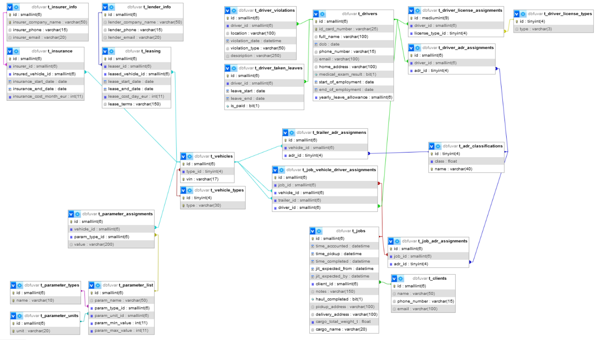
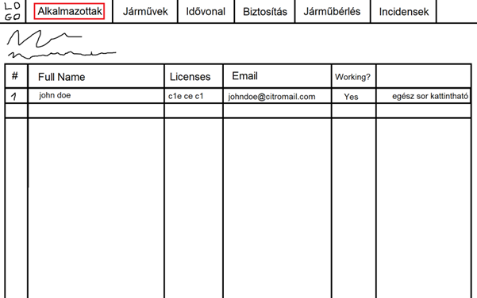
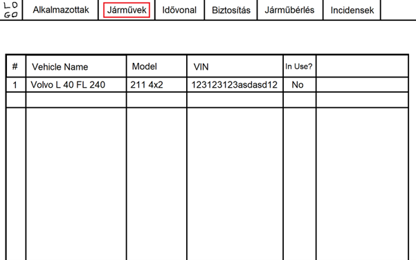
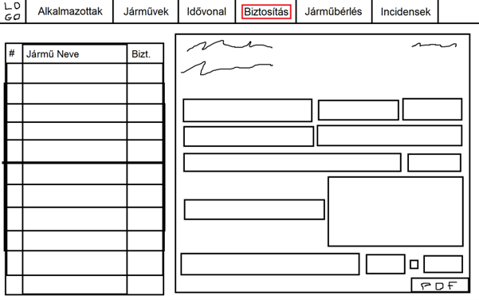
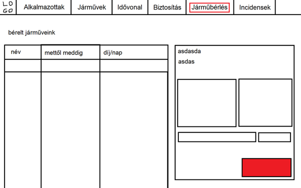
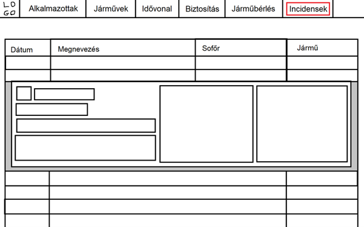

# Futár Menedzser Projekt

### Koncepció

&ensp;A projekt egy fuvarcéget segítő adminisztrációs-, és dolgozókat eligazító segédprogram lesz.

&ensp;Két különböző “módja” lenne: egy az menedzsereknek és egy a fuvarosoknak. Az menedzser mód-ban lehet adminisztrátori feladatokat ellátni pl: 

- Alkalmazottak kezelése
- Teljesített és jelenleg lefolyó munkák állapotának megtekintése
- Múlt-, jelen- és jövőbeli fuvarok “órarendszerű” felületen levő ábrázolása
- Új munkák kiadása
- Új járművek felvevése
- Meglévő járművek adatainak módosítása megtekintése (biztosítások, alkalmazottak adatai, más cégektől bérelt járművek információinak megtekintése - ebbe beletartoznak a szerződések)
- Szerződés-sémák generálása
- Incidensek feljegyzése, sérülések megtekintése
- Alkalmazottak szabadnapjainak kezelése/megnézése
- Alkalmazottakkal való szöveges kommunikáció*
- Stb...

&ensp;A fuvarosoknak készített mód pedig tartalmaz mindent amire egy a cégnél dolgozó fuvarosnak szüksége lehet pl:

- Időtábla megtekintése
- Balesetek, sérülések bejelentése
- Munkák részleges kezelése/leadása
- Integrált térkép használata
- Szabadnapok kérése/intézése a programon belül
- Menedzserekkel, felettesekkel való szöveges kommunikáció*

### UI

&ensp;Ahogy a képeken is látható, a program felhasználói interfésze hasonlítani fog a Krétához, a fókusz az a pontosságon és modularitáson, emellett a könnyű kezelhetőségen lesz. A programnak lesz egy sötét és világos módja. 

&ensp;A felhasználónak arra is lesz lehetősége, hogy a színsémát magának állítsa be (elsődleges, másodlagos és kiegészítő stb… színekkel), vagy választhat a beépített színsémák közül.

### Adatbázis

&ensp;Az adatbázis a projekthez az már el is készült, bár lehet, hogy a jövőben még módosítani/bővíteni kell. Lentebb be van szúrva egy kép az adatbázisról amit a program használni fog.

#### Az adatbázis működése

&ensp;A t_parameter_assignments tábla a járművek paramétereit tárolja el: egy teherautónak van egy “alaptömeg” paramétere egy lebegőpontos számbeli értékkel, melynek mértékegysége “t”, vagy egy “rendszámtábla“ paraméter egy “varchar” típusú értékkel, melynek nem lenne mértékegysége (nullable). A paraméter típusát, mértékegységét (ha van) és a minimum - maximum értékét (ha van) a t_parameter_list táblában tároljuk.

&ensp;A t_parameter_types szükséges lesz a webappon levő beviteli mezők kezelésénél.

&ensp;A t_vehicle_types tábla azért nincs a paraméterek között, mert a jármű típusa olyan információ, amit semmiképp nem szabad tévesen/hibásan rögzíteni, ugyanarra utaló tárgyra különböző névvel felvenni.

<table>
<colgroup>
    <col/>
    <col/>
    <col/>
    <col/>
</colgroup>
<thead>
<tr class="header">
<th>tábla neve</th>
<th>Mező neve</th>
<th>Mező típusa</th>
<th>Leírás</th>
</tr>
</thead>
<tbody>
<tr>
<td rowspan="4">

t_insurer_info

</td>
<td>id<strong>🔑</strong></td>
<td>smallint(6)</td>
<td>A biztosító cég azonosítója</td>
</tr>
<tr>
<td>insurer_company_name</td>
<td>varchar(50)</td>
<td>A biztosító cég neve</td>
</tr>
<tr>
<td>insurer_phone</td>
<td>varchar(15)</td>
<td>A biztosító cég telefonszáma</td>
</tr>
<tr>
<td>insurer_email</td>
<td>varchar(20)</td>
<td>A biztosító e-mail címe</td>
</tr>
<tr>
<td rowspan="6">

t_insurance

</td>
<td>id<strong>🔑</strong></td>
<td>smallint(6)</td>
<td>A biztosítás azonosítója</td>
</tr>
<tr>
<td>insurer_id<strong>🔑</strong></td>
<td>smallint(6)</td>
<td>A biztosítást biztosító cég azonosítója. A t_insurer_info(id)-ra
mutat</td>
</tr>
<tr>
<td>insured_vehicle_id<strong>🔑</strong></td>
<td>smallint(6)</td>
<td>A biztosított jármű azonosítója. A t_vehicles(id)-ra mutat</td>
</tr>
<tr>
<td>insurance_start_date</td>
<td>date</td>
<td>A biztosítás kezdetének dátuma</td>
</tr>
<tr>
<td>insurance_end_date</td>
<td>date</td>
<td>A biztosítás lejárásának dátuma</td>
</tr>
<tr>
<td>insurance_cost_month_eur</td>
<td>int(11)</td>
<td>A biztosítás havi költsége euróban</td>
</tr>
<tr>
<td rowspan="4">

t_lender_info

</td>
<td>id<strong>🔑</strong></td>
<td>smallint(6)</td>
<td>A járművet kölcsönadó cég azonosítója</td>
</tr>
<tr>
<td>lender_company_name</td>
<td>varchar(50)</td>
<td>A járművet kölcsönadó cég neve</td>
</tr>
<tr>
<td>lender_phone</td>
<td>varchar(15)</td>
<td>A járművet kölcsönadó cég telefonszáma</td>
</tr>
<tr>
<td>lender_email</td>
<td>varchar(20)</td>
<td>A járművet kölcsönadó cég email címe</td>
</tr>
<tr>
<td rowspan="7">

t_leasing

</td>
<td>id<strong>🔑</strong></td>
<td>smallint(6)</td>
<td>A kölcsönvevés azonosítója</td>
</tr>
<tr>
<td>leaser_id<strong>🔑</strong></td>
<td>smallint(6)</td>
<td>A kölcsönadó azonosítója. A t_lender_info(id)-ra mutat.</td>
</tr>
<tr>
<td>leased_vehicle_id<strong>🔑</strong></td>
<td>smallint(6)</td>
<td>A kölcsönkért jármű azonosítója. A t_vehicles(id)-ra mutat.</td>
</tr>
<tr>
<td>lease_start_date</td>
<td>date</td>
<td>A kölcsönvevés kezdetének dátuma</td>
</tr>
<tr>
<td>lease_end_date</td>
<td>date</td>
<td>A kölcsönvevés lejárásának dátuma</td>
</tr>
<tr>
<td>lease_cost_day_eur</td>
<td>int(11)</td>
<td>A kölcsönvevés ára naponta euróban</td>
</tr>
<tr>
<td>lease_terms</td>
<td>varchar(150)</td>
<td>A kölcsönvevés további feltételei</td>
</tr>
<tr>
<td rowspan="4">

t_parameter_assignments

</td>
<td>id<strong>🔑</strong></td>
<td>smallint(6)</td>
<td>A paraméter hozzárendelés azonosítója</td>
</tr>
<tr>
<td>vehicle_id<strong>🔑</strong></td>
<td>smallint(6)</td>
<td>A jármű azonosítója amihez hozzárendelték a paramétert. A
t_vehicles(id)-ra mutat.</td>
</tr>
<tr>
<td>param_type_id<strong>🔑</strong></td>
<td>smallint(6)</td>
<td>A hozzárendelt paraméter. A t_parameter_list(id)-ra mutat</td>
</tr>
<tr>
<td>value</td>
<td>varchar(200)</td>
<td>A paraméter értéke</td>
</tr>
<tr>
<td rowspan="6">

t_parameter_list

</td>
<td>id<strong>🔑</strong></td>
<td>smallint(6)</td>
<td>A paraméter fajtájának azonosítója</td>
</tr>
<tr>
<td>param_name</td>
<td>varchar(50)</td>
<td>A paraméter neve</td>
</tr>
<tr>
<td>param_type_id<strong>🔑</strong></td>
<td>smallint(6)</td>
<td>A paraméter típusának az azonosítója. A t_parameter_types(id)-ra
mutat.</td>
</tr>
<tr>
<td>param_unit_id<strong>🔑</strong></td>
<td>smallint(6)</td>
<td>A paraméter mértékegységének az azonosítója. A
t_parameter_units(id)-ra mutat.</td>
</tr>
<tr>
<td>param_min_value</td>
<td>int(11)</td>
<td>A paraméter minimum értéke (ha értelmezhető)</td>
</tr>
<tr>
<td>param_max_value</td>
<td>int(11)</td>
<td>A paraméter minimum értéke (ha értelmezhető)</td>
</tr>
<tr>
<td rowspan="2">

t_parameter_types

</td>
<td>id<strong>🔑</strong></td>
<td>smallint(6)</td>
<td>A paraméter típusának az azonosítója</td>
</tr>
<tr>
<td>name</td>
<td>varchar(10)</td>
<td>A paraméter típusának a neve pl: tömeg, rendszám, stb…</td>
</tr>
<tr>
<td rowspan="2">

t_parameter_units

</td>
<td>id<strong>🔑</strong></td>
<td>smallint(6)</td>
<td>A mértékegység azonosítója</td>
</tr>
<tr>
<td>name</td>
<td>varchar(20)</td>
<td>A mértékegység pl: tonna, liter, km/h, stb…</td>
</tr>
<tr>
<td rowspan="3">

t_vehicles

</td>
<td>id<strong>🔑</strong></td>
<td>smallint(6)</td>
<td>A jármű azonosítója</td>
</tr>
<tr>
<td>type_id<strong>🔑</strong></td>
<td>tinyint(4)</td>
<td>A jármű típusának az azonosítója. A t_vehicle_types(id)-ra
mutat.</td>
</tr>
<tr>
<td>vin</td>
<td>varchar(17)</td>
<td>A jármű alvázszáma</td>
</tr>
<tr>
<td rowspan="2">

t_vehicle_types

</td>
<td>id🔑</td>
<td>tinyint(4)</td>
<td>A jármű fajtának az id-je</td>
</tr>
<tr>
<td>type</td>
<td>varchar(30)</td>
<td>A jármű típusának a fajtája pl: teherautó, utánfutó, stb…</td>
<td></td>
</tr>
<tr>
<td rowspan="4">

t_clients

</td>
<td>id<strong>🔑</strong></td>
<td>smallint(6)</td>
<td>Az ügyfél azonosítója</td>
<td></td>
</tr>
<tr>
<td>name</td>
<td>varchar(50)</td>
<td>Az ügyfél neve</td>
<td></td>
</tr>
<tr>
<td>phone_number</td>
<td>varchar(15)</td>
<td>Az ügyfél telefonszáma</td>
<td></td>
</tr>
<tr>
<td>email</td>
<td>varchar(100)</td>
<td>Az ügyfél email címe</td>
<td></td>
</tr>
<tr>
<td rowspan="11">

t_jobs

</td>
<td>id<strong>🔑</strong></td>
<td>smallint(6)</td>
<td>A rendelés azonosítója</td>
<td></td>
</tr>
<tr>
<td>time_accounted</td>
<td>datetime</td>
<td>Az időpont, amikor a rendelést leadták</td>
<td></td>
</tr>
<tr>
<td>time_pickup</td>
<td>datetime</td>
<td>Az időpont, amikor a vezető felvette a szállítandó dolgot</td>
<td></td>
</tr>
<tr>
<td>time_completed</td>
<td>datetime</td>
<td>Az időpont, amikor a vezető befejezte a rendelést</td>
<td></td>
</tr>
<tr>
<td>jit_expected_from</td>
<td>datetime</td>
<td>„Just in time”, a „minimum” időpont, amire a megrendelő elvárja, a
rendelés befejezését</td>
<td></td>
</tr>
<tr>
<td>jit_expected_by</td>
<td>datetime</td>
<td>„Just in time”, a „maximum” időpont, amire a megrendelő elvárja, a
rendelés befejezését</td>
<td></td>
</tr>
<tr>
<td>client_id<strong>🔑</strong></td>
<td>smallint(6)</td>
<td>A megrendelő azonosítója. A t_clients(id)-ra mutat.</td>
<td></td>
</tr>
<tr>
<td>notes</td>
<td>varchar(150)</td>
<td>Akármi extra információ, a rendeléssel kapcsolatban</td>
<td></td>
</tr>
<tr>
<td>haul_completed</td>
<td>bit(1)</td>
<td>Egy igaz-hamis mező, ami azt jelzi, hogy sikerült-e a rendelés</td>
<td></td>
</tr>
<tr>
<td>pickup_address</td>
<td>varchar(100)</td>
<td>A szállítandó dolog felvételi helyének a címe</td>
<td></td>
</tr>
<tr>
<td>delivery adress</td>
<td>varchar(100)</td>
<td>A cím, ahova vinni kell a szállítandó dolgot</td>
<td></td>
</tr>
<tr>
<td rowspan="3">

t_job_adr_assignments

</td>
<td>id<strong>🔑</strong></td>
<td>smallint(6)</td>
<td>Az adr hozzárendelés azonosítója</td>
<td></td>
</tr>
<tr>
<td>job_id<strong>🔑</strong></td>
<td>smallint(6)</td>
<td>A rendelés amihez hozzá van rendelve az adr jelzés. A t_jobs(id)-ra
mutat</td>
<td></td>
</tr>
<tr>
<td>adr_id<strong>🔑</strong></td>
<td>tinyint(4)</td>
<td>Az adr jelzés azonosítója. A t_adr_classifications(id)-ra mutat</td>
<td></td>
</tr>
<tr>
<td rowspan="3">

t_adr_classifications

</td>
<td>id<strong>🔑</strong></td>
<td>tinyint(4)</td>
<td>Az adr jelzés azonosítója</td>
<td></td>
</tr>
<tr>
<td>class</td>
<td>float</td>
<td>Az adr jelzés osztálya</td>
<td></td>
</tr>
<tr>
<td>name</td>
<td>varchar(40)</td>
<td>Az adr jelzés neve</td>
<td></td>
</tr>
<tr>
<td rowspan="3">

t_trailer_adr_assignments

</td>
<td>id<strong>🔑</strong></td>
<td>smallint(6)</td>
<td>A hozzárendelés azonosítója</td>
<td></td>
</tr>
<tr>
<td>vehicle_id<strong>🔑</strong></td>
<td>smallint(6)</td>
<td>A jármű azonosítója, jelenleg viszi az utánfutót. A
t_vehicles(id)-ra mutat.</td>
<td></td>
</tr>
<tr>
<td>adr_id<strong>🔑</strong></td>
<td>tinyint(4)</td>
<td>A szállított dolog adr jelzésének azonosítója. a
t_adr_classifications(id)-ra mutat</td>
<td></td>
</tr>
<td rowspan="5">

t_job_vehicle_driver_assignments

</td>
<td>id<strong>🔑</strong></td>
<td>smallint(6)</td>
<td>A hozzárendelés azonosítója</td>
</tr>
<tr>
<td>job_id<strong>🔑</strong></td>
<td>smallint(6)</td>
<td>A munka azonosítója, amihez hozzá vannak rendelve az adatok. A
t_jobs(id)-ra mutat.</td>
</tr>
<tr>
<td>vehicle_id<strong>🔑</strong></td>
<td>smallint(6)</td>
<td>A munkához hozzárendelt jármű azonosítója. A t_vehicles(id)-ra
mutat.</td>
</tr>
<tr>
<td>trailer_id<strong>🔑</strong></td>
<td>smallint(6)</td>
<td>A munkához hozzárendelt utánfutó azonosítója. A t_vehicles(id)-ra
mutat.</td>
</tr>
<tr>
<td>driver_id<strong>🔑</strong></td>
<td>smallint(6)</td>
<td>A munkához hozzárendelt alkalmazott azonosítója. A t_drivers(id)-ra
mutat</td>
</tr>
</thead>
<tbody>
<tr>
<td rowspan="11">

t_drivers

</td>
<td>id<strong>🔑</strong></td>
<td>smallint(6)</td>
<td>A sofőr azonosítója</td>
</tr>
<tr>
<td>id_card_number</td>
<td>varchar(25)</td>
<td>A sofőr személyigazolvány száma</td>
</tr>
<tr>
<td>full_name</td>
<td>varchar(100)</td>
<td>A sofőr teljes neve</td>
</tr>
<tr>
<td>dob</td>
<td>date</td>
<td>A sofőr születési dátuma</td>
</tr>
<tr>
<td>phone_number</td>
<td>varchar(15)</td>
<td>A sofőr telefonszáma</td>
</tr>
<tr>
<td>email</td>
<td>varchar(100)</td>
<td>A sofőr email címe</td>
</tr>
<tr>
<td>home_address</td>
<td>varchar(100)</td>
<td>A sofőr lakcíme</td>
</tr>
<tr>
<td>medical_exam_result</td>
<td>bit(1)</td>
<td>egy igen-nem változó, ami a sofőr egészségügyi alkalmasságát
jelzi</td>
</tr>
<tr>
<td>start_of_employment</td>
<td>date</td>
<td>A sofőr munkaviszonyának kezdete (dátum)</td>
</tr>
<tr>
<td>end_of_employment</td>
<td>date</td>
<td>A sofőr munkaviszonyának vége (dátum)</td>
</tr>
<tr>
<td>yearly_leave_allowance</td>
<td>smallint(6)</td>
<td>A sofőr maradék évi szabadnapjainak száma</td>
</tr>
<tr>
<td rowspan="6">

t_driver_violations

</td>
<td>id<strong>🔑</strong></td>
<td>smallint(6)</td>
<td>A szabálysértés azonosítója</td>
</tr>
<tr>
<td>driver_id<strong>🔑</strong></td>
<td>smallint(6)</td>
<td>A szabálysértést elkövető sofőr azonosítója. A t_drivers(id)-ra
mutat.</td>
</tr>
<tr>
<td>location</td>
<td>varchar(100)</td>
<td>A szabálysértés helyszíne</td>
</tr>
<tr>
<td>violation_date</td>
<td>datetime</td>
<td>A szabálysértés elkövetésének időpontja</td>
</tr>
<tr>
<td>violation_type</td>
<td>varchar(50)</td>
<td>A szabálysértés típusa</td>
</tr>
<tr>
<td>description</td>
<td>varchar(250)</td>
<td>A szabálysértés leírása</td>
</tr>
<tr>
<td rowspan="5">

t_driver_taken_leaves

</td>
<td>id<strong>🔑</strong></td>
<td>smallint(6)</td>
<td>A szabadság azonosítója</td>
</tr>
<tr>
<td>driver_id<strong>🔑</strong></td>
<td>smallint(6)</td>
<td>A szabadnapot kivevő sofőr azonosítója. A t_driver(id)-ra
mutat.</td>
</tr>
<tr>
<td>leave_start</td>
<td>date</td>
<td>A szabadság kezdete</td>
</tr>
<tr>
<td>leave_end</td>
<td>date</td>
<td>A szabadság vége</td>
</tr>
<tr>
<td>is_paid</td>
<td>bit(1)</td>
<td>egy igen-nem mező ami azt jelzi, hogy fizetett-e a szabadság</td>
</tr>
<tr>
<td rowspan="3">

t_driver_adr_assignments

</td>
<td>id<strong>🔑</strong></td>
<td>smallint(6)</td>
<td>A hozzárendelés azonosítója</td>
</tr>
<tr>
<td>driver_id<strong>🔑</strong></td>
<td>smallint(6)</td>
<td>A hozzárendelt sofőr azonosítója. A t_drivers(id)-ra mutat.</td>
</tr>
<tr>
<td>adr_id<strong>🔑</strong></td>
<td>tinyint(4)</td>
<td>A hozzárendelt adr osztály azonosítója. A
t_adr_classifications(id)-ra mutat.</td>
</tr>
<tr>
<td rowspan="3">

t_driver_license_assignments

</td>
<td>id<strong>🔑</strong></td>
<td>mediumint(9)</td>
<td>A hozzárendelt jogosítvány azonosítója</td>
</tr>
<tr>
<td>driver_id<strong>🔑</strong></td>
<td>smallint(6)</td>
<td>A sofőr azonosítója, akihez rendelve van a jogosítvány. A
t_drivers(id)-ra mutat.</td>
</tr>
<tr>
<td>license_type_id<strong>🔑</strong></td>
<td>tinyint(4)</td>
<td>A jogosítvány típusának az azonosítója. A
t_driver_license_types(id)-ra mutat.</td>
</tr>
<tr>
<td rowspan="2">

t_driver_license_types

</td>
<td>id</td>
<td>tinyint(4)</td>
<td>A jogosítvány típus azonosítója</td>
</tr>
<tr>
<td>type</td>
<td>varchar(3)</td>
<td>A jogosítvány típusa</td>
</tr>
</tbody>
</table>

### Sablonképek az aloldalak, fülek elrendezéséről

### Használt technológiák:

- [Flutter](https://flutter.dev/)
- [jQuery](https://jquery.com/)
- [Tailwind](https://tailwindcss.com/)
- [Git](https://git-scm.com/)
- [Docker](https://www.docker.com/)
- [Figma](https://www.figma.com/)

### Készítők

- Karvalics Milán Vajk
- Kacsári Dávid